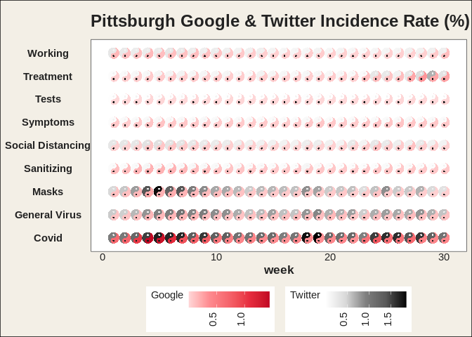

ggtaichi
================

<!-- badges: start -->

[](https://lifecycle.r-lib.org/articles/stages.html#experimental)
<!-- badges: end -->

`ggtaichi` is a `ggplot2` extension that compares data from two sources
on a single grid of taichi (yin-yang) diagrams. A regular heat map made
with `geom_tile()` encodes three dimensions (the `x`, `y` position and
one value); `geom_taichi()` turns every cell into a taichi symbol whose
two interlocking fish are filled by **two** sources at once, so four
dimensions are expressed on one plot.

## Installation

You can install the development version from GitHub with:

``` r
# install.packages("devtools")
devtools::install_github("PursuitOfDataScience/ggtaichi")
```

## Usage

The built-in `pitts_tg` dataset collects the 30-week COVID-related
Google & Twitter incidence rates for 9 categories in the Pittsburgh
Metropolitan Statistical Area (MSA). Every cell becomes a taichi
diagram: the `yang` (light) fish carries one source and the `yin` (dark)
fish carries the other, each shaded by luminance.

``` r
library(ggtaichi)
library(ggplot2)

ggplot(pitts_tg, aes(x = week, y = category)) +
  geom_taichi(yin = Twitter, yang = Google) +
  theme_taichi() +
  ggtitle("Pittsburgh Google & Twitter Incidence Rate (%) Comparison")
```

<!-- -->

See `vignette("ggtaichi")` for the full tour, including the eyes, the
color scales, and the `theme_taichi()` / `remove_padding()` helpers.

## Acknowledgement

`ggtaichi` is built on top of, and is the spiritual sibling of, the
[`ggDoubleHeat`](https://CRAN.R-project.org/package=ggDoubleHeat)
package, which introduced the idea of folding two data sources into a
single reformed heat map through the `geom_heat_*()` family. `ggtaichi`
reuses that two-scale design (and its example data) and re-imagines the
per-cell glyph as a taichi diagram. `ggDoubleHeat` is the foundational
layer of this package and should be cited when you use `ggtaichi`:

> Yu Y, Buskirk T (2025). *ggDoubleHeat: A Heatmap-Like Visualization
> Tool*. R package version 0.1.3.
> <https://CRAN.R-project.org/package=ggDoubleHeat>

    @Manual{,
      title  = {ggDoubleHeat: A Heatmap-Like Visualization Tool},
      author = {Youzhi Yu and Trent Buskirk},
      year   = {2025},
      note   = {R package version 0.1.3},
      url    = {https://CRAN.R-project.org/package=ggDoubleHeat},
    }
