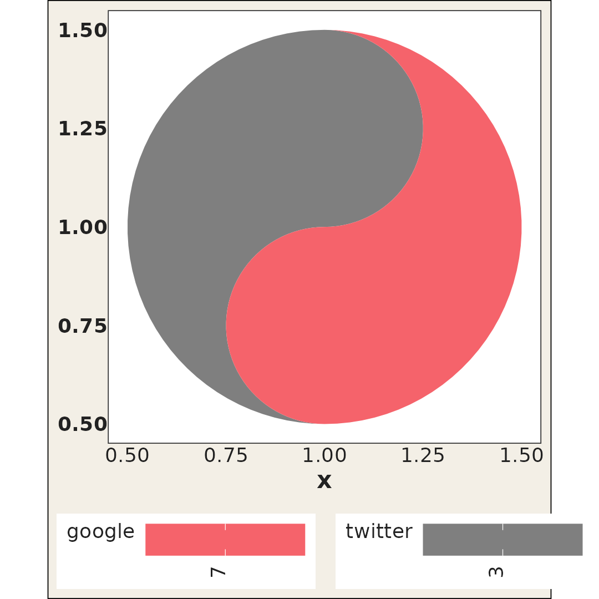
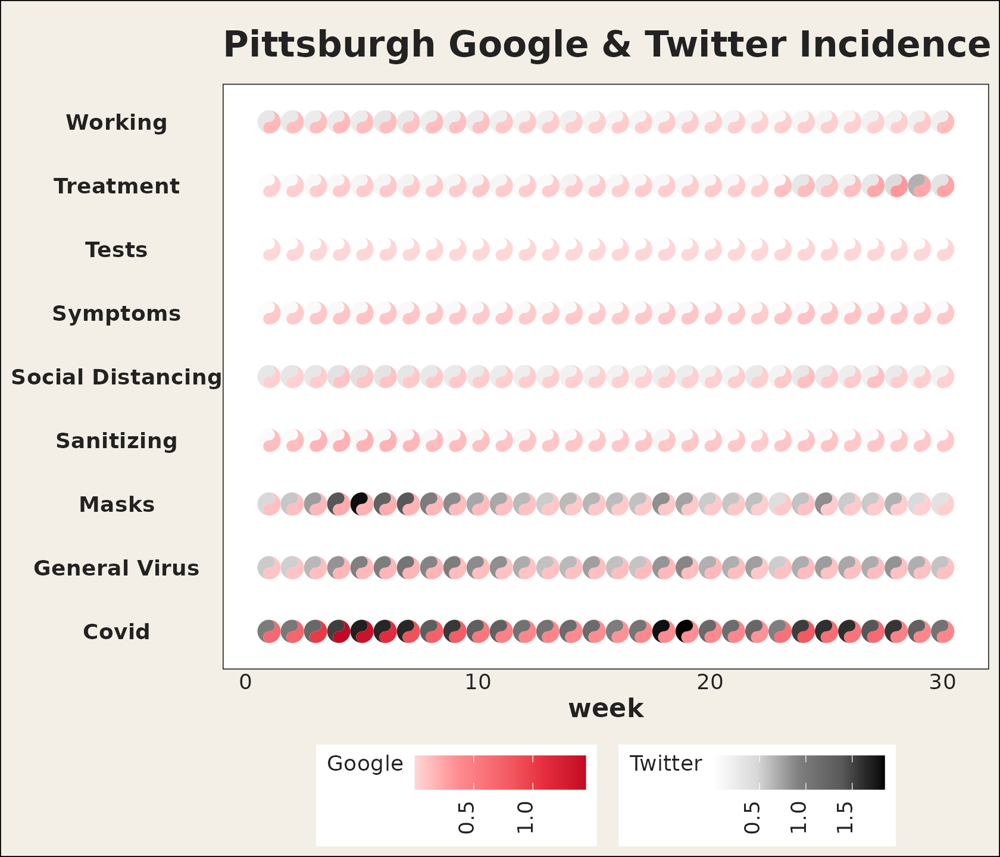
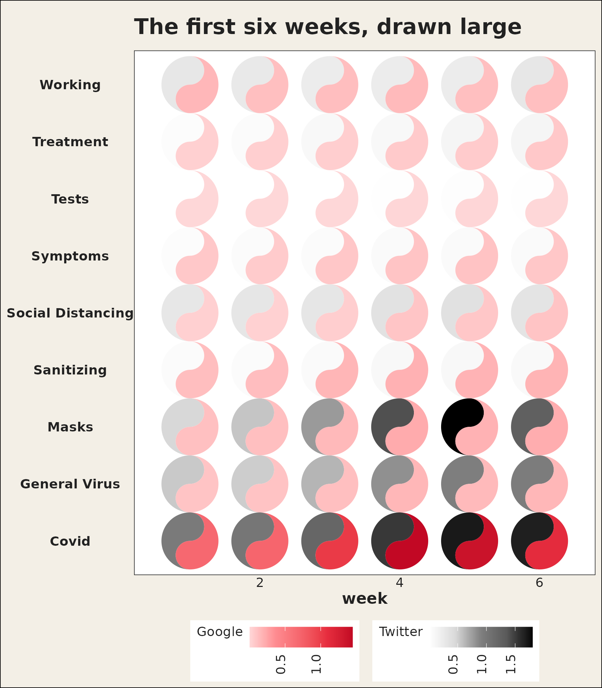
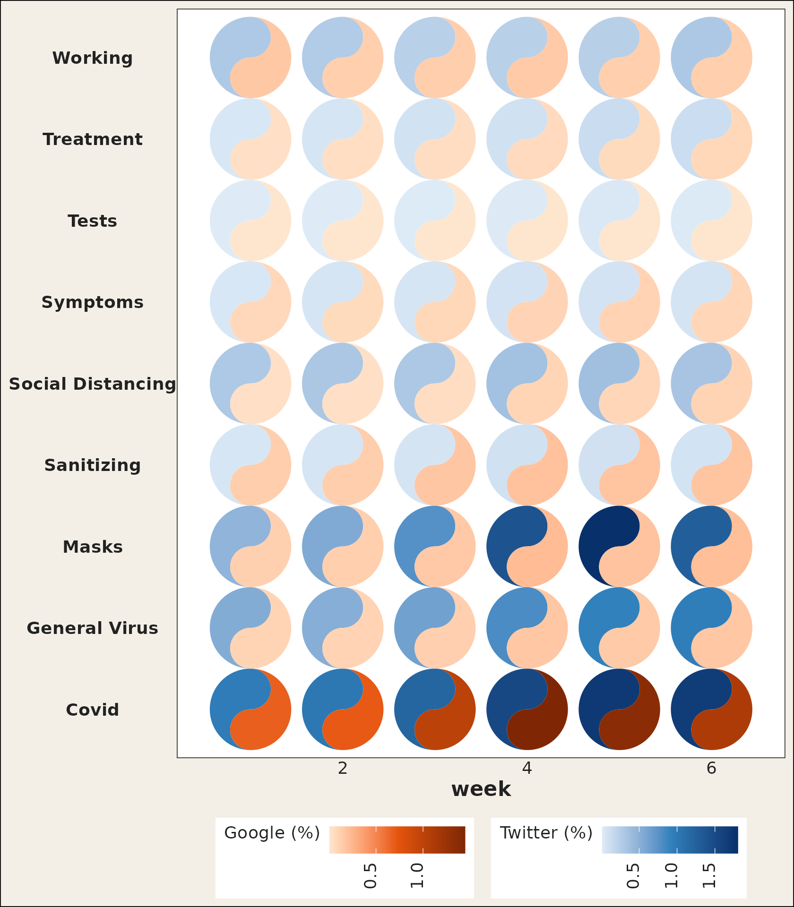
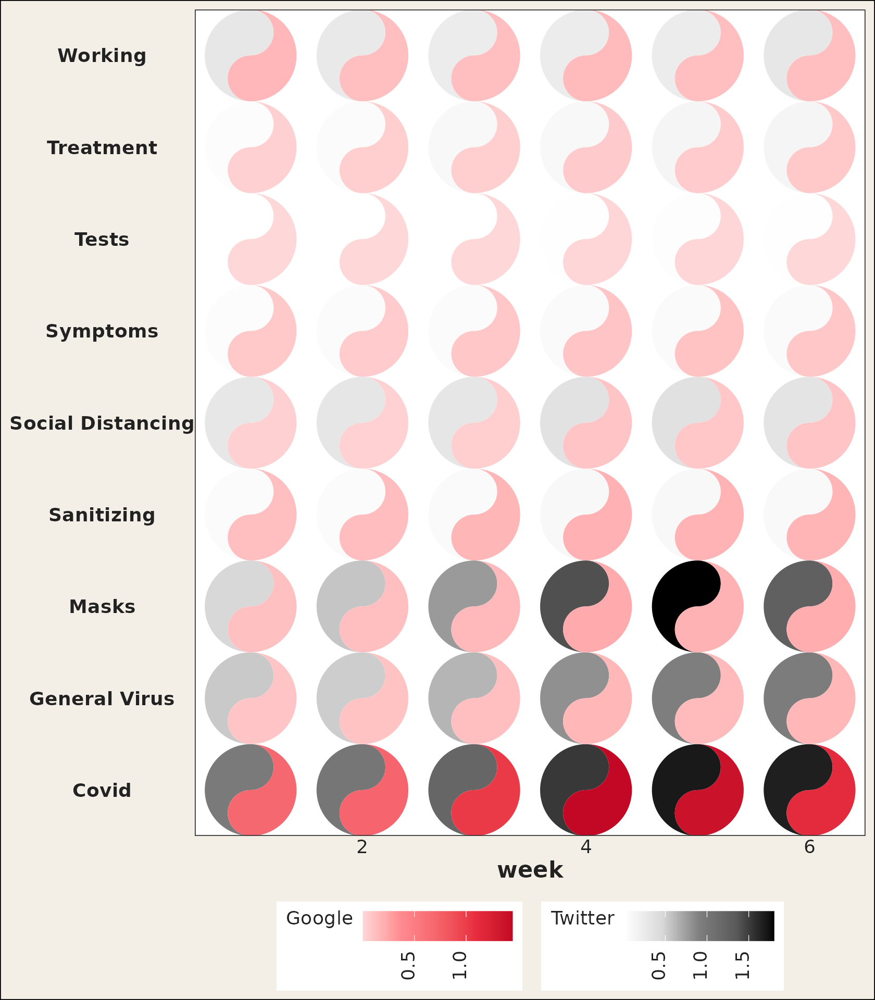
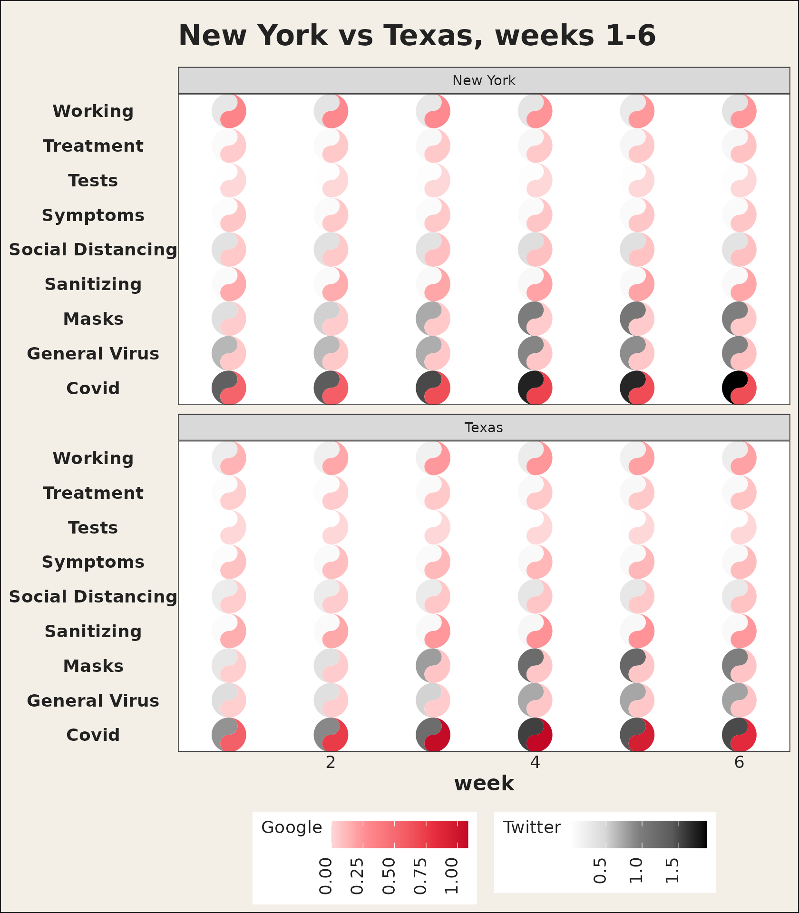
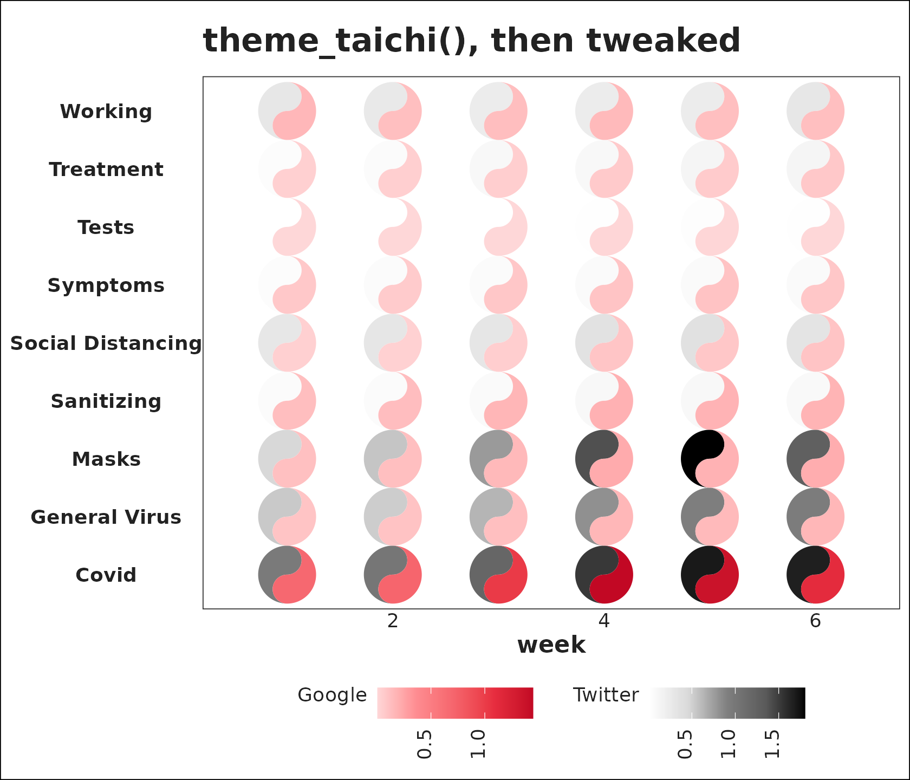

# Introduction to ggtaichi

## Why taichi?

A heat map drawn with
[`ggplot2::geom_tile()`](https://ggplot2.tidyverse.org/reference/geom_tile.html)
carries three dimensions of information: the `x` position, the `y`
position, and a single value mapped to fill. That is plenty when there
is one number per cell, but it forces you to *facet* (or to draw two
separate maps) the moment you want to compare two data sources on the
same footing.

`ggtaichi` removes that limitation by replacing each cell with a
**taichi** (yin-yang) diagram. The symbol is a circle split by an
S-curve into two interlocking “fish”:

- the **yang** (light) fish is shaded by one data source, and
- the **yin** (dark) fish is shaded by the other.

Because both fish live in the same cell, a single
[`geom_taichi()`](https://pursuitofdatascience.github.io/ggtaichi/reference/geom_taichi.md)
layer encodes **four** dimensions at once: `x`, `y`, `yin`, and `yang`.
The two sources keep their own color scales and legends, so they can be
read independently while still being compared side by side. There are no
decorative eyes or markers – every drop of ink on the plot is mapped to
data.

``` r

library(ggtaichi)
library(ggplot2)
```

## Reading a single symbol

It is worth zooming in on one cell to see the anatomy of the glyph. The
yang fish (its bulb at the bottom) carries one source; the yin fish (its
bulb at the top) carries the other. Each half is filled by its own
gradient, so a lighter or darker shade is a smaller or larger value.

``` r

one <- data.frame(x = 1, y = 1, google = 7, twitter = 3)

ggplot(one, aes(x, y)) +
  geom_taichi(yin = twitter, yang = google) +
  coord_fixed() +
  theme_taichi()
```



Here the yang (red) fish reads `7` and the yin (grey) fish reads `3`;
the deeper the ink, the larger the number relative to the rest of the
data.

## The example data

`ggtaichi` ships with the same data sets used by its foundational
package `ggDoubleHeat`. `pitts_tg` records the 30-week COVID-related
Google and Twitter incidence rates for 9 categories in the Pittsburgh
Metropolitan Statistical Area (MSA).

``` r

head(pitts_tg)
#> # A tibble: 6 × 6
#>   msa         week week_start category          Twitter Google
#>   <chr>      <int> <date>     <chr>               <dbl>  <dbl>
#> 1 Pittsburgh     1 2020-06-01 Covid              0.965  0.681 
#> 2 Pittsburgh     1 2020-06-01 General Virus      0.538  0.0982
#> 3 Pittsburgh     1 2020-06-01 Masks              0.466  0.117 
#> 4 Pittsburgh     1 2020-06-01 Sanitizing         0.0561 0.127 
#> 5 Pittsburgh     1 2020-06-01 Social Distancing  0.294  0.0386
#> 6 Pittsburgh     1 2020-06-01 Symptoms           0.0457 0.0770
```

`states_tg` is the larger sibling, repeating the same measurements
across four states, and `pitts_emojis` holds the most popular weekly
emoji per category. See
[`?pitts_tg`](https://pursuitofdatascience.github.io/ggtaichi/reference/pitts_tg.md),
[`?states_tg`](https://pursuitofdatascience.github.io/ggtaichi/reference/states_tg.md),
and
[`?pitts_emojis`](https://pursuitofdatascience.github.io/ggtaichi/reference/pitts_emojis.md)
for the full descriptions.

## A first taichi grid

The two value columns are passed to the `yin` and `yang` arguments.
Everything else – the `x`/`y` mapping, faceting, titles – is plain
`ggplot2`. The legend titles default to the column names you supplied
(`Twitter` and `Google` here).

``` r

ggplot(pitts_tg, aes(x = week, y = category)) +
  geom_taichi(yin = Twitter, yang = Google) +
  theme_taichi() +
  ggtitle("Pittsburgh Google & Twitter Incidence Rate (%)")
```



Each symbol stays round regardless of the panel’s aspect ratio, so you
do **not** need
[`coord_fixed()`](https://ggplot2.tidyverse.org/reference/coord_fixed.html).
The shape is sized in square units, like the radius of a
[`grid::circleGrob()`](https://rdrr.io/r/grid/grid.circle.html).

## Fewer cells, bigger glyphs

Thirty weeks across nine categories is a lot of ink in one panel. When
the goal is to *read* individual symbols rather than scan an overall
texture, subset the data: fewer cells means each taichi is drawn larger.

``` r

pitts_small <- subset(pitts_tg, week <= 6)

ggplot(pitts_small, aes(x = week, y = category)) +
  geom_taichi(yin = Twitter, yang = Google) +
  theme_taichi() +
  ggtitle("The first six weeks, drawn large")
```



## Which source should be yin?

`yin` defaults to a grey (luminance) ramp and `yang` to a red ramp,
echoing the “ink and seal” look of a classic taichi. The choice is
yours, but a useful rule of thumb is to put the source you want to read
as *intensity* on `yin` (the eye reads darkness quickly) and the source
you want to read as *warmth* on `yang`.

## Customizing the color scales

Each fish gets its own gradient. `yang_colors` and `yin_colors` accept
any color vector (usually hex codes), and `yang_name` / `yin_name`
relabel the legends. Any extra argument is forwarded to
[`ggplot2::scale_fill_gradientn()`](https://ggplot2.tidyverse.org/reference/scale_gradient.html),
so you can, for example, set common `limits` so both legends share a
scale, or pass an `na.value`.

``` r

ggplot(pitts_small, aes(x = week, y = category)) +
  geom_taichi(
    yin = Twitter,  yin_name = "Twitter (%)",
    yin_colors = c("#deebf7", "#3182bd", "#08306b"),
    yang = Google, yang_name = "Google (%)",
    yang_colors = c("#fee6ce", "#e6550d", "#7f2704")
  ) +
  theme_taichi()
```



## Removing the panel padding

`ggplot2` leaves a margin around discrete and continuous scales, which
can make a taichi grid look like it is floating.
[`remove_padding()`](https://pursuitofdatascience.github.io/ggtaichi/reference/remove_padding.md)
trims it; tell it whether each axis is continuous (`"c"`) or discrete
(`"d"`).

``` r

ggplot(pitts_small, aes(x = week, y = category)) +
  geom_taichi(yin = Twitter, yang = Google) +
  remove_padding(x = "c", y = "d") +
  theme_taichi()
```



## Comparing places with facets

Because
[`geom_taichi()`](https://pursuitofdatascience.github.io/ggtaichi/reference/geom_taichi.md)
is an ordinary layer, faceting works out of the box. The `states_tg`
data set carries the same measurements across four states; pairing two
of them over a few weeks keeps every glyph large and legible.

``` r

two_states <- subset(states_tg, state %in% c("New York", "Texas") & week <= 6)

ggplot(two_states, aes(x = week, y = category)) +
  geom_taichi(yin = Twitter, yang = Google) +
  facet_wrap(~ state, ncol = 1) +
  remove_padding(x = "c", y = "d") +
  theme_taichi() +
  ggtitle("New York vs Texas, weeks 1-6")
```



## Theming

[`theme_taichi()`](https://pursuitofdatascience.github.io/ggtaichi/reference/theme_taichi.md)
is a light, off-white companion theme that bottoms the legends, drops
the panel grid and ticks, and emphasizes the axis labels. It is a normal
`ggplot2` theme, so you can override any element afterwards, or skip it
entirely and bring your own.

``` r

ggplot(pitts_small, aes(x = week, y = category)) +
  geom_taichi(yin = Twitter, yang = Google) +
  theme_taichi() +
  theme(plot.background = element_rect(fill = "white")) +
  ggtitle("theme_taichi(), then tweaked")
```



## Acknowledgement

`ggtaichi` stands on the shoulders of the
[`ggDoubleHeat`](https://CRAN.R-project.org/package=ggDoubleHeat)
package, which pioneered the two-source “double” heat map through its
`geom_heat_*()` family and supplies the example data used throughout
this vignette. Please cite it alongside `ggtaichi`:

> Yu Y, Buskirk T (2025). *ggDoubleHeat: A Heatmap-Like Visualization
> Tool*. R package version 0.1.3. CRAN:
> <https://CRAN.R-project.org/package=ggDoubleHeat>, GitHub:
> <https://github.com/PursuitOfDataScience/ggDoubleHeat>
