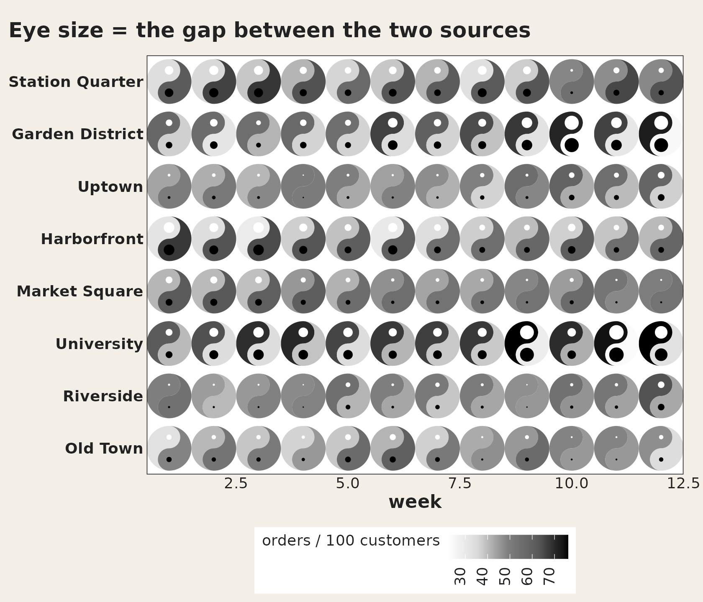
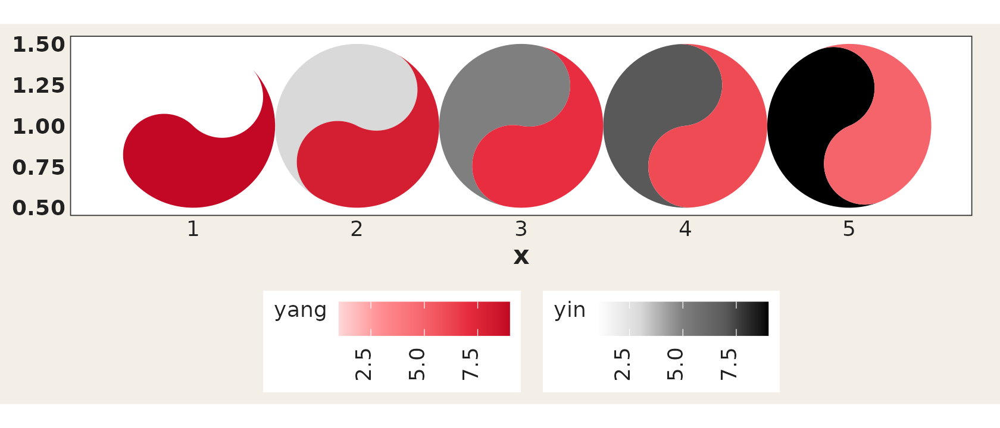
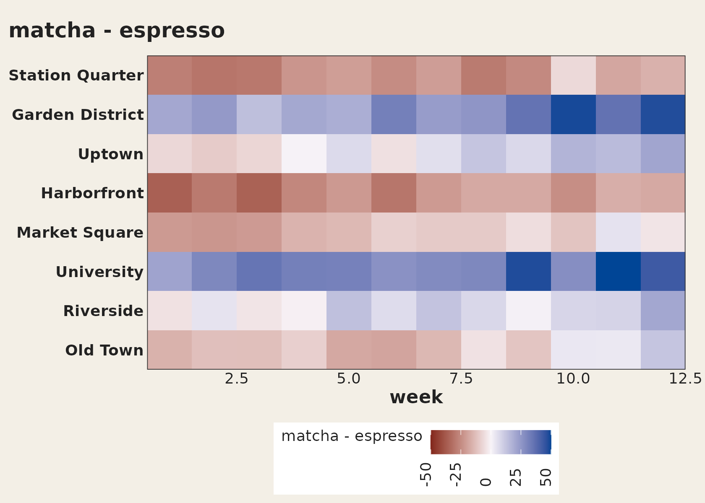
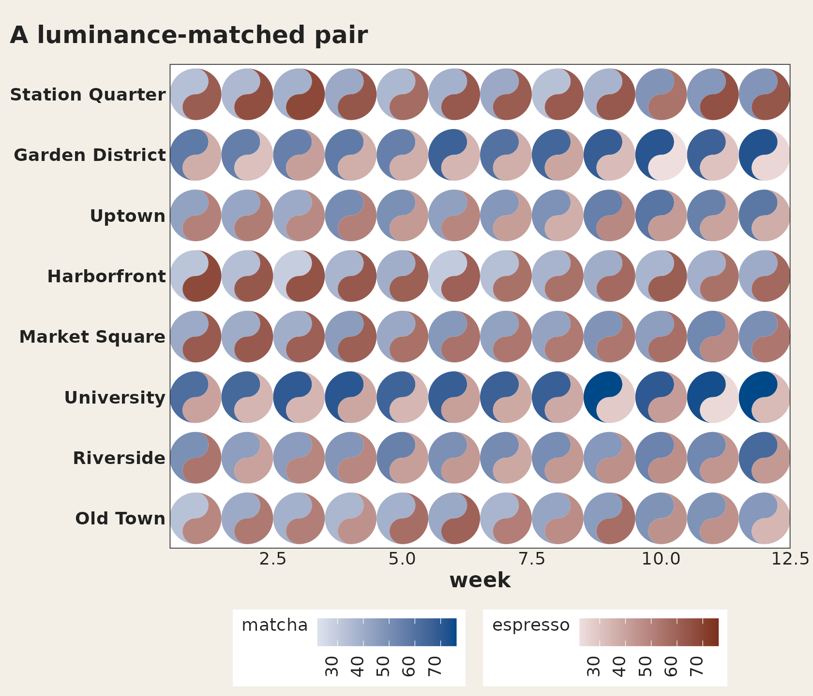
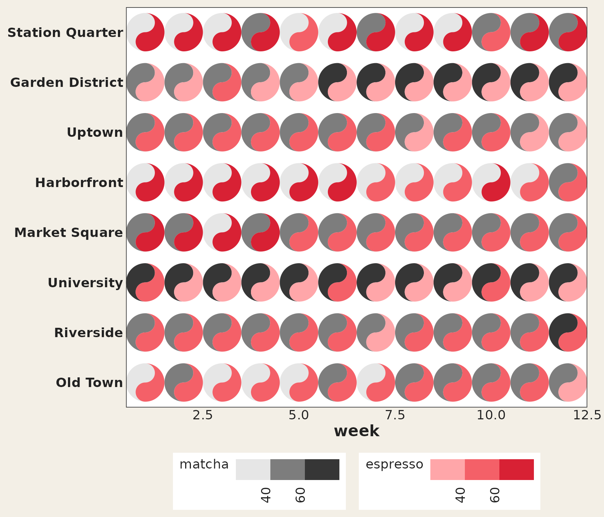

# Introduction to ggtaichi

## Why taichi?

A heat map drawn with
[`ggplot2::geom_tile()`](https://ggplot2.tidyverse.org/reference/geom_tile.html)
carries three dimensions of information: the `x` position, the `y`
position, and a single value mapped to fill. That is plenty when there
is one number per cell, but it forces you to *facet* (or to draw two
separate maps) the moment you want to compare two data sources on the
same footing.

`ggtaichi` removes that limitation by replacing each cell with a
**taichi** (yin-yang) diagram. The symbol is a circle split by an
S-curve into two interlocking “fish”:

- the **yang** (light) fish is shaded by one data source, and
- the **yin** (dark) fish is shaded by the other.

Because both fish live in the same cell, a single
[`geom_taichi()`](https://pursuitofdatascience.github.io/ggtaichi/reference/geom_taichi.md)
layer encodes **four** dimensions at once: `x`, `y`, `yin`, and `yang`.
The two sources keep their own color scales and legends, so they can be
read independently while still being compared side by side. By default
there are no decorative eyes or markers – every drop of ink on the plot
is mapped to data – and when you do switch the classic eyes on
(`eyes = TRUE`, new in v0.2.0), they can carry data too, taking a single
glyph up to **six** dimensions.

``` r

library(ggtaichi)
library(ggplot2)
```

## Reading a single symbol

It is worth zooming in on one cell to see the anatomy of the glyph. The
yang fish (its bulb at the bottom) carries one source; the yin fish (its
bulb at the top) carries the other. Each half is filled by its own
gradient, so a lighter or darker shade is a smaller or larger value.

``` r

one <- data.frame(x = 1, y = 1, google = 7, twitter = 3)

ggplot(one, aes(x, y)) +
  geom_taichi(yin = twitter, yang = google) +
  coord_fixed() +
  theme_taichi()
```


Here the yang (red) fish reads `7` and the yin (grey) fish reads `3`;
the deeper the ink, the larger the number relative to the rest of the
data.

## The example data

`ggtaichi` ships with the same data sets used by its foundational
package `ggDoubleHeat`. `pitts_tg` records the 30-week COVID-related
Google and Twitter incidence rates for 9 categories in the Pittsburgh
Metropolitan Statistical Area (MSA).

``` r

head(pitts_tg)
#> # A tibble: 6 × 6
#>   msa         week week_start category          Twitter Google
#>   <chr>      <int> <date>     <chr>               <dbl>  <dbl>
#> 1 Pittsburgh     1 2020-06-01 Covid              0.965  0.681 
#> 2 Pittsburgh     1 2020-06-01 General Virus      0.538  0.0982
#> 3 Pittsburgh     1 2020-06-01 Masks              0.466  0.117 
#> 4 Pittsburgh     1 2020-06-01 Sanitizing         0.0561 0.127 
#> 5 Pittsburgh     1 2020-06-01 Social Distancing  0.294  0.0386
#> 6 Pittsburgh     1 2020-06-01 Symptoms           0.0457 0.0770
```

`states_tg` is the larger sibling, repeating the same measurements
across four states, and `pitts_emojis` holds the most popular weekly
emoji per category. Since v0.2.0 the package also bundles `cafes_tg`, a
small *synthetic* espresso-vs-matcha dataset whose two columns share the
same units — handy for the shared-scale features shown later. See
[`?pitts_tg`](https://pursuitofdatascience.github.io/ggtaichi/reference/pitts_tg.md),
[`?states_tg`](https://pursuitofdatascience.github.io/ggtaichi/reference/states_tg.md),
[`?pitts_emojis`](https://pursuitofdatascience.github.io/ggtaichi/reference/pitts_emojis.md),
and
[`?cafes_tg`](https://pursuitofdatascience.github.io/ggtaichi/reference/cafes_tg.md)
for the full descriptions.

## A first taichi grid

The two value columns are passed to the `yin` and `yang` arguments.
Everything else – the `x`/`y` mapping, faceting, titles – is plain
`ggplot2`. The legend titles default to the column names you supplied
(`Twitter` and `Google` here).

``` r

ggplot(pitts_tg, aes(x = week, y = category)) +
  geom_taichi(yin = Twitter, yang = Google) +
  theme_taichi() +
  ggtitle("Pittsburgh Google & Twitter Incidence Rate (%)")
```


Each symbol stays round regardless of the panel’s aspect ratio, so you
do **not** need
[`coord_fixed()`](https://ggplot2.tidyverse.org/reference/coord_fixed.html).
The shape is sized in square units, like the radius of a
[`grid::circleGrob()`](https://rdrr.io/r/grid/grid.circle.html).

## Fewer cells, bigger glyphs

Thirty weeks across nine categories is a lot of ink in one panel. When
the goal is to *read* individual symbols rather than scan an overall
texture, subset the data: fewer cells means each taichi is drawn larger.

``` r

pitts_small <- subset(pitts_tg, week <= 6)

ggplot(pitts_small, aes(x = week, y = category)) +
  geom_taichi(yin = Twitter, yang = Google) +
  theme_taichi() +
  ggtitle("The first six weeks, drawn large")
```


## Which source should be yin?

`yin` defaults to a grey (luminance) ramp and `yang` to a red ramp,
echoing the “ink and seal” look of a classic taichi. The choice is
yours, but a useful rule of thumb is to put the source you want to read
as *intensity* on `yin` (the eye reads darkness quickly) and the source
you want to read as *warmth* on `yang`.

## Customizing the color scales

Each fish gets its own scale. `yang_colors` and `yin_colors` accept any
color vector (usually hex codes), and `yang_name` / `yin_name` relabel
the legends. Any extra argument in `...` is forwarded to *both*
auto-built fill scales, so you can, for example, set common `limits` so
the two legends share a range, or pass an `na.value`. When the two fish
need *different* scale options – or an entirely different scale type –
hand a scale object or constructor to `yin_scale` / `yang_scale` and it
is used verbatim.

``` r

ggplot(pitts_small, aes(x = week, y = category)) +
  geom_taichi(
    yin = Twitter,  yin_name = "Twitter (%)",
    yin_colors = c("#deebf7", "#3182bd", "#08306b"),
    yang = Google, yang_name = "Google (%)",
    yang_colors = c("#fee6ce", "#e6550d", "#7f2704")
  ) +
  theme_taichi()
```


## Removing the panel padding

`ggplot2` leaves a margin around discrete and continuous scales, which
can make a taichi grid look like it is floating.
[`remove_padding()`](https://pursuitofdatascience.github.io/ggtaichi/reference/remove_padding.md)
trims it — as of v0.2.0 it detects each axis’s scale type by itself, and
you can still spell it out with `"c"` (continuous) / `"d"` (discrete)
when you want to override the detection.

``` r

ggplot(pitts_small, aes(x = week, y = category)) +
  geom_taichi(yin = Twitter, yang = Google) +
  remove_padding() +
  theme_taichi()
```


## Comparing places with facets

Because
[`geom_taichi()`](https://pursuitofdatascience.github.io/ggtaichi/reference/geom_taichi.md)
is an ordinary layer, faceting works out of the box. The `states_tg`
data set carries the same measurements across four states; pairing two
of them over a few weeks keeps every glyph large and legible.

``` r

two_states <- subset(states_tg, state %in% c("New York", "Texas") & week <= 6)

ggplot(two_states, aes(x = week, y = category)) +
  geom_taichi(yin = Twitter, yang = Google) +
  facet_wrap(~ state, ncol = 1) +
  remove_padding(x = "c", y = "d") +
  theme_taichi() +
  ggtitle("New York vs Texas, weeks 1-6")
```


## Theming

[`theme_taichi()`](https://pursuitofdatascience.github.io/ggtaichi/reference/theme_taichi.md)
is a light, off-white companion theme that bottoms the legends, drops
the panel grid and ticks, and emphasizes the axis labels. It is a normal
`ggplot2` theme, so you can override any element afterwards, or skip it
entirely and bring your own.

``` r

ggplot(pitts_small, aes(x = week, y = category)) +
  geom_taichi(yin = Twitter, yang = Google) +
  theme_taichi() +
  theme(plot.background = element_rect(fill = "white")) +
  ggtitle("theme_taichi(), then tweaked")
```


## The glyph’s other channels

### Rotation

The `angle` argument rotates each glyph by the given number of degrees.
It can be a constant (same angle for every cell) or a column name (one
angle per cell), encoding a directional or temporal variable as
orientation.

``` r

one_rot <- data.frame(
  x = c(1, 2, 1, 2),
  y = c(2, 2, 1, 1),
  yin = c(3, 5, 7, 9),
  yang = c(9, 7, 5, 3),
  rot = c(0, 45, 90, 180)
)

ggplot(one_rot, aes(x, y)) +
  geom_taichi(yin = yin, yang = yang, angle = rot,
              limits = c(0, 10)) +
  coord_fixed() +
  theme_taichi()
```


### Data-driven eyes

Setting `eyes = TRUE` draws the classic taichi dots, each sitting in its
own fish’s head: the yin eye in the top bulb, the yang eye in the bottom
one. With the default white and black dots the glyph looks exactly like
the traditional symbol.

``` r

one_eye <- data.frame(
  x = c(1, 2, 1, 2),
  y = c(2, 2, 1, 1),
  yin = c(3, 5, 7, 9),
  yang = c(9, 7, 5, 3)
)

ggplot(one_eye, aes(x, y)) +
  geom_taichi(yin = yin, yang = yang, eyes = TRUE,
              limits = c(0, 10)) +  # shared limits keep the palest fish visible
  coord_fixed() +
  theme_taichi()
```


The eyes are not just decoration: `yin_eye_size`, `yang_eye_size`,
`yin_eye_colour`, and `yang_eye_colour` all accept either a constant *or
an unquoted column name*, so the two dots can encode up to two further
variables – a **fifth and sixth dimension** on top of `x`, `y`, and the
two fills. A mapped size column is rescaled to eye radii between 5% and
30% of the glyph radius (values already between 0 and 0.5 are used as
exact proportions, and an `NA` suppresses the eye for that cell).

``` r

one_eye$reach   <- c(10, 40, 25, 5)   # drives the yin eye
one_eye$quality <- c(2, 1, 4, 8)      # drives the yang eye

ggplot(one_eye, aes(x, y)) +
  geom_taichi(yin = yin, yang = yang,
              eyes = TRUE,
              yin_eye_size = reach,
              yang_eye_size = quality,
              limits = c(0, 10)) +
  coord_fixed() +
  theme_taichi()
```


### Categorical fills

[`geom_taichi()`](https://pursuitofdatascience.github.io/ggtaichi/reference/geom_taichi.md)
now automatically detects whether the `yin` / `yang` columns are numeric
or discrete (factor / character / logical) and picks the appropriate
scale – computed expressions such as `factor(week)` work too. With the
default palettes the discrete colors are sampled from the ramp skipping
its palest end, so every category stays visible.

``` r

disc <- data.frame(
  x = c(1, 2, 1, 2),
  y = c(2, 2, 1, 1),
  method = factor(c("A", "B", "C", "A")),
  outcome = factor(c("win", "loss", "win", "loss"))
)

ggplot(disc, aes(x, y)) +
  geom_taichi(yin = method, yang = outcome) +
  coord_fixed() +
  theme_taichi()
```


For full control, hand any fill scale – an object or a constructor
function – to `yin_scale` / `yang_scale`; it overrides the
auto-detection and the `*_colors` vectors entirely:

``` r

ggplot(disc, aes(x, y)) +
  geom_taichi(yin = method, yang = outcome,
              yin_scale = scale_fill_viridis_d,
              yang_scale = scale_fill_viridis_d(name = "outcome", option = "rocket",
                                                begin = 0.4, end = 0.8)) +
  coord_fixed() +
  theme_taichi()
```


### Missing values

A fish whose fill value is `NA` is painted in its scale’s `na.value`
colour (grey by default; pass e.g. `na.value = "transparent"` through
`...` to hide it), so one missing source never suppresses the other
fish. `na.rm = TRUE` additionally drops rows with missing positions, and
an `NA` eye size simply skips that cell’s eye.

### Geom parameter routing

All standard geom parameters (`alpha`, `colour`, `linewidth`,
`linetype`, `width`, `height`, `na.rm`, `show.legend`) are now properly
accepted by
[`geom_taichi()`](https://pursuitofdatascience.github.io/ggtaichi/reference/geom_taichi.md)
and forwarded to the underlying fish geoms. The deprecated `size`
aesthetic has been replaced with `linewidth`.

``` r

one_lwd <- data.frame(
  x = c(1, 2, 1, 2),
  y = c(2, 2, 1, 1),
  yin = c(3, 5, 7, 9),
  yang = c(9, 7, 5, 3)
)

ggplot(one_lwd, aes(x, y)) +
  geom_taichi(yin = yin, yang = yang,
              alpha = 0.7, linewidth = 1.5, colour = "#333333") +
  coord_fixed() +
  theme_taichi()
```


### Shared limits and a single legend

When the two sources are measured in the same units, two separate
legends are noise. `shared_limits = TRUE` aligns the limits of both fill
scales (the union range of the two columns, or the union of levels for
two discrete sources), so equal values carry equal ink.
`shared_legend = TRUE` goes further: both fish use the yin palette and
only one legend is shown. The synthetic `cafes_tg` data is the natural
demo — espresso and matcha orders per 100 customers:

``` r

ggplot(cafes_tg, aes(x = week, y = neighbourhood)) +
  geom_taichi(yin = matcha, yang = espresso,
              shared_legend = TRUE,
              yin_name = "orders / 100 customers") +
  remove_padding() +
  theme_taichi() +
  ggtitle("Espresso (yang) vs matcha (yin)")
```


For diverging data (values around 0), pass a diverging palette to both
color arguments and symmetric limits through `...`, e.g.
`limits = c(-5, 5)` — both fish then hinge on the same midpoint.

### The fish geoms are exported

[`geom_yin_fish()`](https://pursuitofdatascience.github.io/ggtaichi/reference/geom_yin_fish.md)
and
[`geom_yang_fish()`](https://pursuitofdatascience.github.io/ggtaichi/reference/geom_yin_fish.md)
— the layers
[`geom_taichi()`](https://pursuitofdatascience.github.io/ggtaichi/reference/geom_taichi.md)
is built from — are now exported and documented. Reach for them when you
want one fish only, or full manual control over scales and
[`ggnewscale::new_scale_fill()`](https://eliocamp.github.io/ggnewscale/reference/new_scale.html)
stacking. See
[`?geom_yin_fish`](https://pursuitofdatascience.github.io/ggtaichi/reference/geom_yin_fish.md).

### Faster rendering

All cells of a layer are now drawn as one batched polygon (and one batch
of eye dots) resolved at draw time, instead of one grob stack per cell.
Large grids and animation frames render several times faster, and glyphs
stay perfectly round when you resize the device.

## New in v0.3.0

### How much bigger? The explicit channel

Two fish sharing one position is what the comparison literature calls a
*superposition* design. Its strength is that the two sources are in the
same place, so spatial patterns line up and “are these similar?” is
answered at a glance. Its weakness is precise: it can say *which* is
bigger, but not *by how much*. For that, the relationship has to be
computed and drawn — what the same literature calls **explicit
encoding**.

`explicit` does that. It takes one of four statistics — `"difference"`
(`yin - yang`), `"ratio"`, `"log_ratio"`, or `"z"` (the difference of
the two standardised sources, for when the two are not in the same
units) — and `explicit_channel` decides where in the glyph it goes.

The default is the eyes, and it is the tidiest option: the eyes already
exist, they are visually subordinate to the fills, and a big eye reads
as “look here”. Cells where the two sources agree exactly get **no eye
at all**, so a plain glyph means agreement.

``` r

ggplot(cafes_tg, aes(x = week, y = neighbourhood)) +
  geom_taichi(yin = matcha, yang = espresso,
              shared_legend = TRUE,
              yin_name = "orders / 100 customers",
              explicit = "difference") +
  remove_padding() +
  theme_taichi() +
  ggtitle("Eye size = the gap between the two sources")
```



`explicit_channel = "angle"` is the most *accurate* choice. Direction
and angle are read far more precisely than shading, so the gap becomes
legible to a precision the fills can never reach: upright means the two
sources agree, and the lean shows which way and how far. The price is
the symbol’s upright orientation, which is why it is a choice rather
than the default.

``` r

tilt <- data.frame(x = 1:5, y = 1, yin = c(1, 3, 5, 7, 9), yang = 9:5)

ggplot(tilt, aes(x, y)) +
  geom_taichi(yin = yin, yang = yang, shared_limits = TRUE,
              explicit = "difference", explicit_channel = "angle") +
  coord_fixed() +
  theme_taichi()
```



The other two channels are `"border"` (outline width) and `"radius"`
(glyph size, scaled by area rather than diameter, so cells where the
sources agree shrink). `explicit_range` sets the output range of
whichever you pick, and the statistic is rescaled across the whole
layer, so facets stay comparable.

A ratio of a zero or negative value is `NA` with a warning — never
`Inf`.

### The same numbers, as a table and as a heatmap

Sometimes the right answer to “by how much?” is not a glyph.
[`taichi_summary()`](https://pursuitofdatascience.github.io/ggtaichi/reference/taichi_summary.md)
returns every statistic per cell, plus which source dominates and the
cell’s rank by the size of the gap:

``` r

summ <- taichi_summary(cafes_tg, yin = matcha, yang = espresso,
                       x = week, y = neighbourhood)
head(summ[order(summ$rank), ], 5)
#>     x               y  yin yang difference    ratio log_ratio        z dominant
#> 35 11      University 74.1 24.0       50.1 3.087500  1.626439 4.260819   matcha
#> 82 10 Garden District 70.9 22.2       48.7 3.193694  1.675226 4.152065   matcha
#> 33  9      University 76.1 28.4       47.7 2.679577  1.422006 4.037432   matcha
#> 84 12 Garden District 72.2 24.7       47.5 2.923077  1.547488 4.038890   matcha
#> 36 12      University 76.1 32.9       43.2 2.313070  1.209809 3.637092   matcha
#>    rank
#> 35    1
#> 82    2
#> 33    3
#> 84    4
#> 36    5
```

and
[`geom_taichi_diff()`](https://pursuitofdatascience.github.io/ggtaichi/reference/geom_taichi_diff.md)
draws it as a diverging heatmap, with limits symmetric about “the two
sources agree”, so the mid colour really is the middle:

``` r

ggplot(cafes_tg, aes(x = week, y = neighbourhood)) +
  geom_taichi_diff(yin = matcha, yang = espresso) +
  remove_padding() +
  theme_taichi() +
  ggtitle("matcha - espresso")
```



Use it *beside* a taichi grid rather than instead of one: the glyphs
show the levels, the tiles show the gap.

### Palette pairing is a correctness problem

The whole point of the design is comparing two sources fairly, and the
fills are what carries the comparison. If the two ramps do not span the
same luminance range then equal values do not produce equal visual
weight, and one fish appears to dominate wherever the data says the two
are level. That is not a matter of taste; it decides whether the chart
is telling the truth.

[`taichi_check_palette()`](https://pursuitofdatascience.github.io/ggtaichi/reference/taichi_check_palette.md)
measures it. With no arguments it measures the package’s own defaults:

``` r

taichi_check_palette()
#> <ggtaichi palette check>
#> 
#>   step yin            L      C   yang           L      C       dL
#>   1    #FFFFFF    100.0    0.0   #FED7D8     89.2   14.5     10.8
#>   2    #EBEBEB     93.0    0.0   #FFB2B3     79.8   30.2     13.2
#>   3    #D8D8D8     86.3    0.0   #FE8C91     70.8   46.6     15.6
#>   4    #AAAAAA     69.6    0.0   #F9787D     65.8   53.9      3.8
#>   5    #7F7F7F     53.2    0.0   #F4636B     61.0   61.4     -7.8
#>   6    #6B6B6B     45.2    0.0   #EE4B54     55.9   70.0    -10.7
#>   7    #595959     37.8    0.0   #E62C3F     50.7   78.1    -12.8
#>   8    #2D2D2D     18.5    0.0   #D41D31     45.8   77.1    -27.3
#>   9    #000000      0.0    0.0   #C10724     40.6   75.7    -40.6
#> 
#>   largest luminance mismatch : 40.6 L* (tolerance 5.0)
#>   largest chroma mismatch    : 78.1
#>   measured in                : CIE Lab (L*, C*ab), CIE2000 distances
#>   how far apart the ramps stay (median distance, step for step)
#>       normal       27.2  
#>       deutan       20.9  
#>       protan       12.7  (much worse than normal vision)
#>       tritan       28.4  
#> 
#>   Verdict: FAIL
#>   the two ramps do not share a luminance trajectory, so equal
#>   values do NOT read as equal ink and one fish will appear to
#>   dominate. Consider `palette = "balanced"` or `taichi_palette_pair()`.
```

The verdict is honest: the grey yin ramp runs the full way to black
while the red yang ramp stops around L\* 41, a mismatch of about 41
units, so the yin fish has always looked heavier at the dark end. **The
defaults have not been changed** — every existing figure would move —
but `palette = "balanced"` gives a pair built to be matched, differing
only in hue:

``` r

taichi_check_palette(palette = "balanced")
#> <ggtaichi palette check>
#> 
#>   step yin            L      C   yang           L      C       dL
#>   1    #DEE3EC     90.1    5.0   #EDDFDE     89.9    5.1      0.2
#>   2    #C5CDDE     82.3    9.4   #E0C7C5     82.2    9.4      0.0
#>   3    #ADB8D1     74.7   13.9   #D2B1AC     74.9   13.1     -0.2
#>   4    #95A4C3     67.2   17.7   #C49A95     67.3   17.2     -0.1
#>   5    #7D91B6     59.9   21.7   #B6857E     60.1   21.0     -0.2
#>   6    #647EA9     52.4   25.9   #A76F66     52.4   25.4     -0.1
#>   7    #4A6C9D     45.1   30.4   #98594E     44.8   30.3      0.3
#>   8    #2F5A93     37.9   36.1   #894433     37.3   36.5      0.6
#>   9    #004888     30.4   41.6   #792E19     29.6   43.2      0.8
#> 
#>   largest luminance mismatch : 0.8 L* (tolerance 5.0)
#>   largest chroma mismatch    : 1.5
#>   measured in                : CIE Lab (L*, C*ab), CIE2000 distances
#>   how far apart the ramps stay (median distance, step for step)
#>       normal       26.4  
#>       deutan       27.7  
#>       protan       22.9  
#>       tritan       40.3  
#> 
#>   Verdict: PASS
#>   the two ramps share a luminance trajectory, so equal values
#>   read as equal ink.
```

``` r

ggplot(cafes_tg, aes(x = week, y = neighbourhood)) +
  geom_taichi(yin = matcha, yang = espresso,
              palette = "balanced", shared_limits = TRUE) +
  remove_padding() +
  theme_taichi() +
  ggtitle("A luminance-matched pair")
```



The other presets are `"diverging"` (both ramps reaching a shared
near-white midpoint, so the two fish read as the two arms of one
diverging scale), `"viridis_pair"`, `"brewer_pair"`, and
`"greyscale_safe"` — a grey ramp and a hued ramp on the *same* luminance
trajectory, so in colour the two fish are told apart by hue and in
greyscale they collapse to the same ink, which keeps equal values equal
in a black-and-white printout.
[`taichi_palette()`](https://pursuitofdatascience.github.io/ggtaichi/reference/taichi_palette.md)
returns any of them, and
[`taichi_palette_pair()`](https://pursuitofdatascience.github.io/ggtaichi/reference/taichi_palette_pair.md)
builds your own from hue, luminance and chroma.

`shared_legend = TRUE` deserves a mention here too. It paints both fish
with one ramp, which makes equal values equal ink *by construction* —
there is no pairing left to get wrong. The cost is that the two sources
are then distinguished only by their position inside the glyph: yin is
the top bulb, yang the bottom. When the two sources really are directly
comparable, that is usually the right trade.

### Binned fills, for grids too dense to read

Reading a value off a continuous luminance ramp is the least accurate
perceptual task there is, and every scalability study of glyph displays
finds performance falling as the glyph count rises. Matching a patch to
one of five labelled bins is much closer to a categorical lookup, and
the legend then says exactly which values share a colour.

``` r

ggplot(cafes_tg, aes(x = week, y = neighbourhood)) +
  geom_taichi(yin = matcha, yang = espresso,
              yin_scale  = scale_taichi_yin_binned(n.breaks = 4),
              yang_scale = scale_taichi_yang_binned(n.breaks = 4),
              shared_limits = TRUE) +
  remove_padding() +
  theme_taichi()
```



`shared_limits` now reaches into the scales you supply, so both fish
share one set of breaks and equal values land in the same bin — which is
the whole point of binning a two-source display. The full family is
[`scale_taichi_yin_c()`](https://pursuitofdatascience.github.io/ggtaichi/reference/scale_taichi.md)
/ `_d()` / `_binned()` / `_viridis_c()` / `_viridis_d()` and their
`yang` counterparts; see
[`?scale_taichi`](https://pursuitofdatascience.github.io/ggtaichi/reference/scale_taichi.md).

### Hovering for the exact values

Everything above is a way of coping with the fact that fill is an
imprecise channel. Interactivity is the other way: it hands the reader
the exact numbers without giving up the encoding. `interactive = TRUE`
makes the fish (and their eyes)
[ggiraph](https://davidgohel.github.io/ggiraph/) grobs, and
[`ggiraph::girafe()`](https://davidgohel.github.io/ggiraph/reference/girafe.html)
turns the plot into a widget:

``` r

p <- ggplot(cafes_tg, aes(x = week, y = neighbourhood)) +
  geom_taichi(yin = matcha, yang = espresso, interactive = TRUE) +
  theme_taichi()

ggiraph::girafe(ggobj = p)
```

The default tooltip carries both values, their difference, and the
cell’s coordinates. `data_id_by` decides what a hover highlights, and
the interesting setting is `"source"`: hovering any yin fish lights up
the yin fish in *every* cell, which turns the superposition display into
a single-source display for as long as the pointer rests there. That is
the one thing a static superposition cannot do — it lets the reader take
the comparison apart instead of doing it in their head. `tooltip`,
`data_id` and `onclick` take a data column when you want to say
something else.

There is a live example in the
[gallery](https://pursuitofdatascience.github.io/ggtaichi/articles/gallery.html).
`plotly` is not supported and will not be: `ggplotly()` cannot translate
custom grobs, which is what this package draws.

### Following the theme

ggplot2 4.0 lets a theme set geom defaults through
`theme(geom = element_geom(ink, paper, accent))`. ggtaichi now reads
them, so the fallback fish, the outlines and both eye colours follow a
dark theme instead of disappearing into it. On any light theme the
result is pixel for pixel what it always was. Legend keys are small
taichi symbols now as well — each fish geom’s key fills its own half —
with `key_glyph = "rect"` to get the old rectangles back.

## When (not) to use taichi

A taichi grid is at its best when *comparing two sources cell by cell*
is the question — the interlocking fish put both numbers in one glance.
A few honest caveats:

- **Dense grids become texture.** Past roughly a thousand cells you stop
  reading symbols and start reading fields; that is still useful for
  spotting bands and regime changes, but for precise lookup, subset (as
  done above) or facet.
- **Luminance is a coarse channel.** Small differences in a fish’s shade
  are hard to judge; when exact comparison matters, add shared limits
  (`shared_limits = TRUE`) so at least the two fish are on the same
  footing, and consider printing the numbers alongside.
- **The two ramps must be a fair pair.** The defaults are not: run
  [`taichi_check_palette()`](https://pursuitofdatascience.github.io/ggtaichi/reference/taichi_check_palette.md)
  and it reports a luminance mismatch of about 41 L\* units between the
  grey and red ramps, which means equal values do not read as equal ink.
  Use `palette = "balanced"` when the comparison has to be fair, and see
  the palette section above.
- **Colour-vision deficiency.**
  [`taichi_check_palette()`](https://pursuitofdatascience.github.io/ggtaichi/reference/taichi_check_palette.md)
  also simulates deuteranopia, protanopia and tritanopia; the default
  pair loses about half its separation under protanopia.
  `palette = "balanced"` holds up, `palette = "greyscale_safe"` survives
  greyscale printing, and
  [`scale_taichi_yin_viridis_c()`](https://pursuitofdatascience.github.io/ggtaichi/reference/scale_taichi.md)
  /
  [`scale_taichi_yang_viridis_c()`](https://pursuitofdatascience.github.io/ggtaichi/reference/scale_taichi.md)
  are there if you prefer the viridis family.
- **One source missing?** An `NA` fish keeps its place (painted in
  `na.value`), so absence is visible rather than silently dropped.

## Acknowledgement

`ggtaichi` is a spinoff of the
[`ggDoubleHeat`](https://CRAN.R-project.org/package=ggDoubleHeat)
package, which pioneered the two-source “double” heat map and supplies
the example data used throughout this vignette. `ggtaichi` takes that
two-scale design and re-imagines the per-cell glyph as a taichi diagram.
