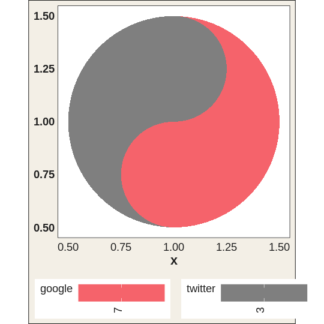
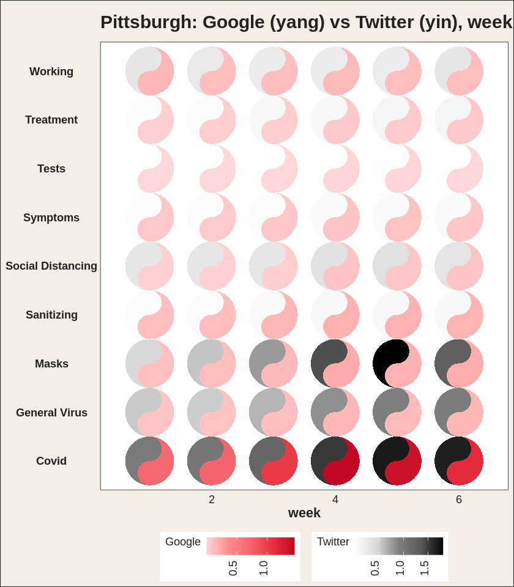
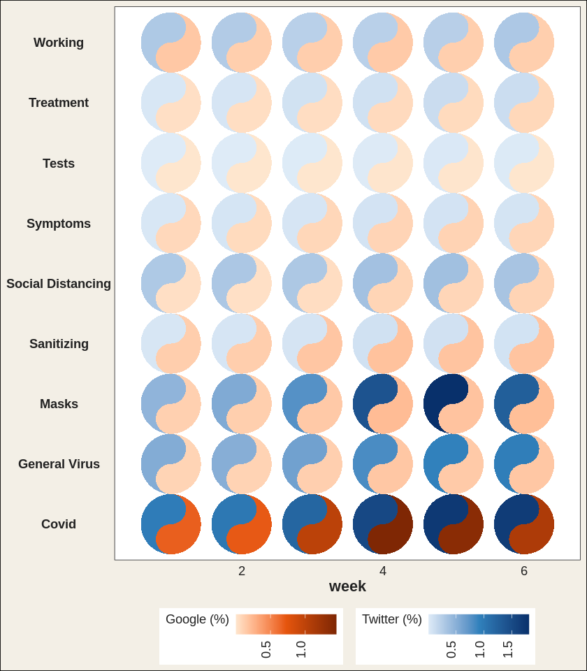
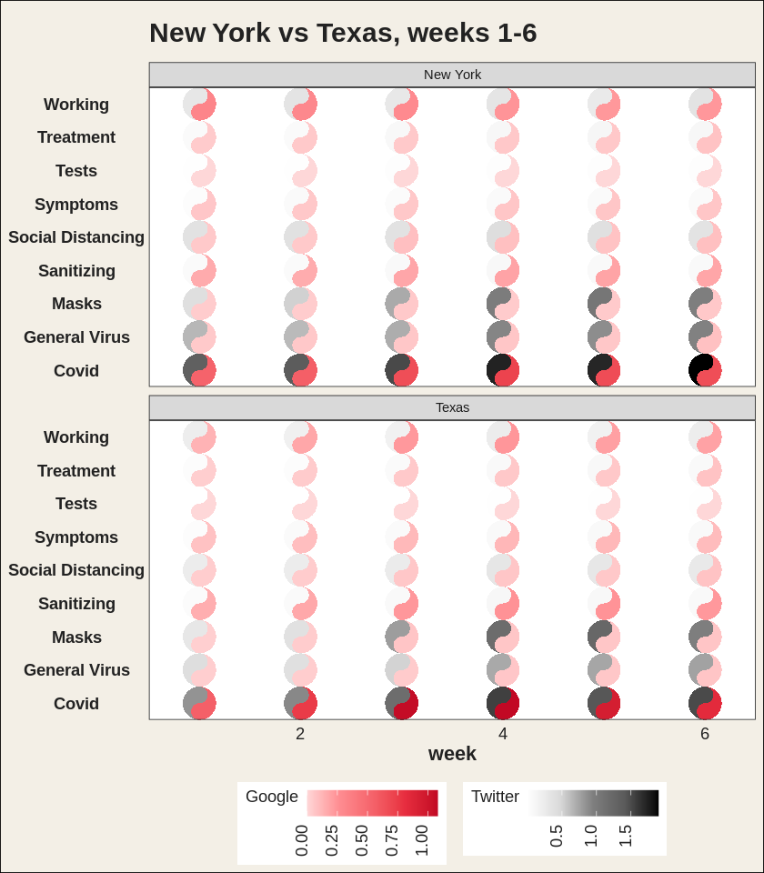

# ggtaichi

`ggtaichi` is a `ggplot2` extension that compares data from two sources
on a single grid of taichi (yin-yang) diagrams. A regular heat map made
with
[`geom_tile()`](https://ggplot2.tidyverse.org/reference/geom_tile.html)
encodes three dimensions (the `x`, `y` position and one value);
[`geom_taichi()`](https://pursuitofdatascience.github.io/ggtaichi/reference/geom_taichi.md)
turns every cell into a taichi symbol whose two interlocking fish are
filled by **two** sources at once, so four dimensions are expressed on
one plot.

## Installation

You can install the development version from GitHub with:

``` r

# install.packages("devtools")
devtools::install_github("PursuitOfDataScience/ggtaichi")
```

## Anatomy of a taichi

Each symbol is a circle split by an S-curve into two interlocking fish.
The **yang** (light) fish is shaded by one source and the **yin** (dark)
fish by the other, each on its own gradient. There are no decorative
dots: every drop of ink is data.

``` r

library(ggtaichi)
library(ggplot2)

one <- data.frame(x = 1, y = 1, google = 7, twitter = 3)

ggplot(one, aes(x, y)) +
  geom_taichi(yin = twitter, yang = google) +
  coord_fixed() +
  theme_taichi()
```



## A clear, small grid

The built-in `pitts_tg` dataset holds the 30-week COVID-related Google
and Twitter incidence rates for 9 categories in the Pittsburgh
Metropolitan Statistical Area. With many weeks the symbols shrink, so it
is often easier to read a slice. Here are the first six weeks, where
each taichi is big enough to compare the two halves at a glance.

``` r

pitts_small <- subset(pitts_tg, week <= 6)

ggplot(pitts_small, aes(x = week, y = category)) +
  geom_taichi(yin = Twitter, yang = Google) +
  theme_taichi() +
  ggtitle("Pittsburgh: Google (yang) vs Twitter (yin), weeks 1-6")
```



The legend titles default to the column names you supply. Note how
`Covid` and `Masks` lean dark (high Twitter) while staying pink
(moderate Google).

## Your own palettes

Each fish gets its own gradient, and any extra argument is passed
straight to
[`ggplot2::scale_fill_gradientn()`](https://ggplot2.tidyverse.org/reference/scale_gradient.html).

``` r

ggplot(pitts_small, aes(x = week, y = category)) +
  geom_taichi(
    yin  = Twitter, yin_name  = "Twitter (%)",
    yin_colors  = c("#deebf7", "#3182bd", "#08306b"),
    yang = Google,  yang_name = "Google (%)",
    yang_colors = c("#fee6ce", "#e6550d", "#7f2704")
  ) +
  theme_taichi()
```



## Comparing places

Because
[`geom_taichi()`](https://pursuitofdatascience.github.io/ggtaichi/reference/geom_taichi.md)
is an ordinary layer, faceting just works. The `states_tg` dataset
repeats the same measurements across four states; showing two of them
over a handful of weeks keeps the glyphs large and legible.

``` r

two_states <- subset(states_tg, state %in% c("New York", "Texas") & week <= 6)

ggplot(two_states, aes(x = week, y = category)) +
  geom_taichi(yin = Twitter, yang = Google) +
  facet_wrap(~ state, ncol = 1) +
  remove_padding(x = "c", y = "d") +
  theme_taichi() +
  ggtitle("New York vs Texas, weeks 1-6")
```



See
[`vignette("ggtaichi")`](https://pursuitofdatascience.github.io/ggtaichi/articles/ggtaichi.md)
for the full tour.

## Acknowledgement

`ggtaichi` is built on top of, and is the spiritual sibling of, the
[`ggDoubleHeat`](https://CRAN.R-project.org/package=ggDoubleHeat)
package, which introduced the idea of folding two data sources into a
single reformed heat map through the `geom_heat_*()` family. `ggtaichi`
reuses that two-scale design (and its example data) and re-imagines the
per-cell glyph as a taichi diagram. `ggDoubleHeat` is the foundational
layer of this package and should be cited when you use `ggtaichi`:

> Yu Y, Buskirk T (2025). *ggDoubleHeat: A Heatmap-Like Visualization
> Tool*. R package version 0.1.3. CRAN:
> <https://CRAN.R-project.org/package=ggDoubleHeat>, GitHub:
> <https://github.com/PursuitOfDataScience/ggDoubleHeat>

``` R
@Manual{,
  title  = {ggDoubleHeat: A Heatmap-Like Visualization Tool},
  author = {Youzhi Yu and Trent Buskirk},
  year   = {2025},
  note   = {R package version 0.1.3.
            GitHub: https://github.com/PursuitOfDataScience/ggDoubleHeat},
  url    = {https://CRAN.R-project.org/package=ggDoubleHeat},
}
```
